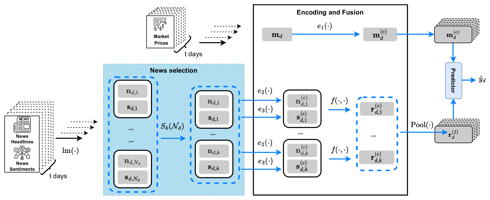

# GreenFin

**Resource-Aware News Selection for Sustainable Financial Market Direction Forecasting**

[](https://github.com/ismailelbouknify/News-selection-for-market-prediction/actions/workflows/tests.yml)


## Overview
GreenFin forecasts the next-day direction of the S&P 500 from market data and financial news while processing far less text. Instead of passing every available headline to the forecaster, it selects a small fixed budget of k headlines per trading day and forecasts from these with a lightweight masked-mean architecture.

This repository contains the implementation, experiment configurations and reproduction pipeline for the paper *GreenFin: Resource-Aware News Selection for Sustainable Financial Market Direction Forecasting*.

## Method

<p align="center">
  
</p>

```
FNSPID headlines + S&P 500 prices
        ↓
RoBERTa headline embeddings + FinBERT sentiment (frozen, computed once)
        ↓
daily news selection: at most k headlines per day
        ↓
GreenFin (masked-mean pooling) or FININ (market-aware attention) forecaster
        ↓
next-day direction → accuracy, PnL, Sharpe, energy / CO₂
```
### 2) Clone the Repository

Selectors (`selection.news_select`): `random`; `topconf` (lowest-entropy FinBERT sentiment, i.e. most confident); `kmeans` (headline nearest each MiniBatch k-means centroid); `farthest` (farthest-point diversity sampling of the embeddings).

## Installation

Python 3.10–3.12. If you need a specific CUDA build of PyTorch, install it first from [pytorch.org](https://pytorch.org).

```bash
git clone https://github.com/ismailelbouknify/News-selection-for-market-prediction.git
cd News-selection-for-market-prediction
python -m venv .venv
source .venv/bin/activate
pip install -U pip
pip install -e ".[data,dev]"
```

The `data` extra is needed only for downloading and preprocessing, and `dev` only for the tests. `requirements.txt` installs the same packages, and `environment/requirements-paper.txt` lists the exact research versions. All commands below are run from the repository root.

## Data

| Source | Content |
|---|---|
| [FNSPID](https://huggingface.co/datasets/Zihan1004/FNSPID) | raw financial news (~23 GB) |
| Yahoo Finance `^GSPC` | S&P 500 daily prices |
| [GreenFin dataset](https://huggingface.co/datasets/ismail-ELBOUKNIFY/news-selection-for-market-prediction) | preprocessed files used in the paper |

No data are stored in this repository. Everything lives under `data/`, which is git-ignored:

```
data/
├── raw/market/sp500.csv                    # S&P 500 prices
├── raw/news/nasdaq_external_data.csv       # raw FNSPID news (rebuild only)
├── interim/cleaned_news.csv                # cleaned news (rebuild only)
├── interim/cleaned_news_sentiment.csv      # FinBERT logits (rebuild only)
├── interim/headline_embeddings_fp16.pt     # RoBERTa embeddings (~22 GB)
└── processed/Input_t{1,3,5,10,20}.jsonl    # one dataset per look-back T
```

The quickest way to get started is to download the preprocessed data (~53 GB in total; add `--lookbacks 5` for the T = 5 experiments only):

```bash
python scripts/data/download_data.py
```

## Preprocessing

To rebuild the data from raw sources instead (a GPU is strongly recommended for steps 3–4; add `--allow-cpu` to run them on CPU):

```bash
python scripts/data/download_external_data.py   # 1. raw FNSPID news
python scripts/data/preprocess_all.py           # 2. clean news, download S&P 500 prices
python scripts/data/build_sentiment.py          # 3. FinBERT sentiment
python scripts/data/build_embeddings.py         # 4. RoBERTa embeddings
python scripts/data/build_dataset.py            # 5. look-back datasets T = 1, 3, 5, 10, 20
```

## Quick start

Run the primary configuration, GreenFin-Selected (farthest-point selection, k = 10, T = 5), over 5 windows × 5 seeds:

```bash
python scripts/experiments/run_experiment.py \
    --experiment-config configs/experiments/selectors/farthest_k10.yaml
```

Add `--seeds 0` for a single seed or `--print-config` to inspect the merged
configuration without running. Each run writes `config.yaml`, `summary.json`,
`windows.csv`, `predictions.csv`, `checkpoints/` and `carbon/` to
`outputs/runs/<experiment_name>/`.

Each experiment YAML overrides `configs/base.yaml`. The main options are:

| Option | Config key |
|---|---|
| selector | `selection.news_select` |
| k (headlines per day) | `selection.cap_per_day` (`null` = all news) |
| T (look-back days) | `data.input_jsonl`: `data/processed/Input_t{T}.jsonl` |
| architecture | `task.use_miq` (`false` = GreenFin, `true` = FININ), `task.use_news` |
| seeds | `train.seed_list` |
| data paths | `data.market_csv`, `data.embeddings_path`, `data.input_jsonl` |

## Reproducing the paper

| Experiment | Command | Hardware |
|---|---|---|
| Architecture ablation (Table 3) | `bash scripts/reproduce/table3_architecture.sh` | GPU |
| Selector × budget (Table 4) | `bash scripts/reproduce/table4_selectors.sh` | GPU |
| Look-back × budget (Table 6) | `bash scripts/reproduce/table6_lookback.sh` | GPU |
| Paired block bootstrap (Table 7) | `bash scripts/reproduce/table7_bootstrap.sh` | CPU, after Tables 3–4 |
| Practical trading (Table 8) | `bash scripts/reproduce/table8_trading.sh` | CPU, after Table 4 |

Summary tables are written to `results/` (see [results/README.md](results/README.md)).
GPU runs need about 22 GB of host RAM for the embedding file; the paper's jobs
requested 128 GB. On a SLURM cluster, `bash scripts/hpc/submit_grid.sh
<architecture|selectors|lookback>` submits one job per config. With the
2,770-day window, T = 20 yields 4 CV windows instead of 5.

## Results
In the paper, the best GreenFin configuration uses **farthest-point selection with k = 10 headlines per day and a look-back of T = 5 days**. It reaches directional accuracy similar to the FININ model using all news (FININ-Full), with about 98% lower training time, energy and CO₂ in the **downstream forecasting stage**. Both models share the same one-off RoBERTa/FinBERT encoding of the corpus, so this is not an end-to-end saving. `scripts/evaluation/aggregate_results.py --upstream-carbon` reports the end-to-end figures. Exact values are given in the paper.


## Repository structure

```
src/greenfin/          core library: model, selectors, CV, metrics, trading, bootstrap
scripts/data/          data download and preprocessing
scripts/experiments/   run_experiment.py, the single entry point for one experiment
scripts/evaluation/    result aggregation, bootstrap significance, practical trading
scripts/reproduce/     one script per paper table, plus a CPU smoke test
scripts/hpc/           optional SLURM templates
configs/               base.yaml and experiment, evaluation and smoke-test configs
tests/                 pytest suite (synthetic data, CPU only)
results/               small result tables written by the reproduction scripts
docs/                  reproducibility notes and the overview figure
environment/           exact package versions of the research environment
```

## Testing

```bash
pytest
bash scripts/reproduce/smoke_test.sh   # optional end-to-end check on CPU (~5 min)
```

Both use small synthetic data. They need neither FNSPID nor a GPU.

## Citation


```bibtex
@unpublished{elbouknify_greenfin,
  title  = {GreenFin: Resource-Aware News Selection for Sustainable Financial Market Direction Forecasting},
  author = {Elbouknify, Ismail and El Mekki, Abdellah and Machado, Marcos R. and Iannario, Maria},
  note   = {Manuscript},
}
```

